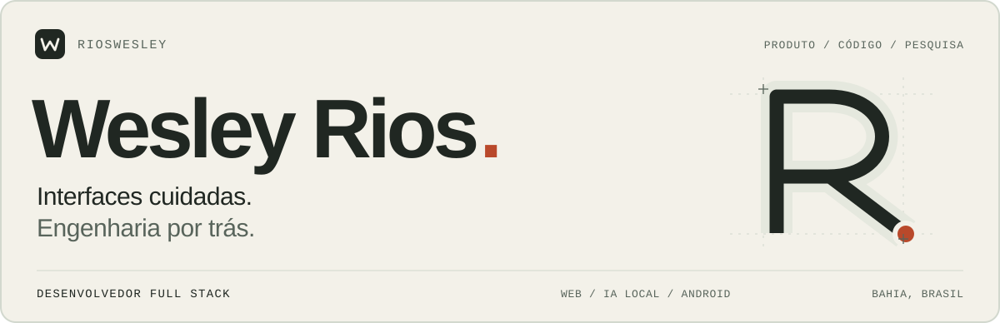
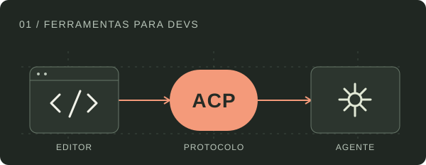
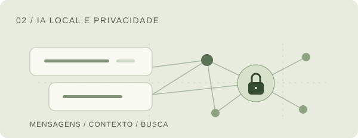

<!-- Assets locais: sem widgets de estatisticas ou servicos externos de imagens. -->
<picture>
  <source media="(max-width: 600px) and (prefers-color-scheme: dark)" srcset="./assets/hero-mobile-dark.svg">
  <source media="(max-width: 600px)" srcset="./assets/hero-mobile-light.svg">
  <source media="(prefers-color-scheme: dark)" srcset="./assets/hero-dark.svg">
  <source media="(prefers-color-scheme: light)" srcset="./assets/hero-light.svg">
  
</picture>

  <a href="https://www.linkedin.com/in/rioswesley1/"><strong>LinkedIn&nbsp;↗</strong></a>
  &nbsp;&nbsp; / &nbsp;&nbsp;
  <a href="mailto:limarioswesley@gmail.com"><strong>E-mail&nbsp;↗</strong></a>

 

Sou **desenvolvedor full stack no [UnDesk](https://undesk.com.br)** e estudante de **Engenharia da Computação**, em Feira de Santana, Bahia.

Trabalho na evolução de um SaaS em produção: interfaces, integrações entre frontend e backend e investigação de bugs. Nos projetos pessoais, exploro **ferramentas para desenvolvedores, IA local e Android**.

## Projetos selecionados

<table>
<tr>
<td width="50%" valign="top">

<h3>AGY ACP Adapter</h3>

<strong>Experimental</strong> · Ferramentas para devs

Adaptador não oficial em Rust para conectar o CLI do Antigravity ao Zed e a outros clientes do Agent Client Protocol.

<strong>Sessões persistentes, streaming e contexto de workspace.</strong> Validação inicial documentada no Zed para Windows.

<code>Rust</code> <code>ACP</code> <code>JSON-RPC</code>

<a href="https://github.com/RiosWesley/agy-zed-acp"><strong>Explorar o projeto ↗</strong></a>

</td>
<td width="50%" valign="top">

<h3>Recall.ai</h3>

<strong>Em desenvolvimento</strong> · Aplicação desktop

Aplicação desktop em desenvolvimento para buscar conversas por significado e fazer perguntas sobre seu conteúdo.

Arquitetura voltada a <strong>RAG, inferência local e privacidade</strong>, com documentação técnica e roadmap.

<code>Electron</code> <code>React</code> <code>SQLite</code>

<a href="https://github.com/RiosWesley/recall-ai"><strong>Explorar o projeto ↗</strong></a>

</td>
</tr>
</table>

### [HoroscopoZap ↗](https://github.com/RiosWesley/HoroscopoZap)

**Protótipo web · Integração full stack.** Análise de conversas do WhatsApp que reúne visualização de dados, IA generativa e integração de pagamentos.

`React` `TypeScript` `Firebase` `Gemini` `Mercado Pago`

## Tecnologias

| Contexto | Tecnologias |
| :--- | :--- |
| **Interfaces web** | TypeScript, React, Vite, Tailwind CSS |
| **APIs e dados** | Node.js, Express, PostgreSQL, Firebase |
| **Ambiente de desenvolvimento** | Git, Docker, Linux |
| **Projetos e pesquisa** | Rust, Python, Electron, LLMs locais, Android |

## Open source e pesquisa

**[JetBrains / swot](https://github.com/JetBrains/swot/pull/39065)**: contribuição integrada para incluir o domínio acadêmico da UNIFAN.

<strong>Android: compatibilidade, instrumentação e IA local</strong>

 

Uma frente de experimentação em dispositivos próprios, separada do trabalho em produto.

**Galaxy S24 Ultra · Contribuição integrada**  
Port de compatibilidade para o modelo internacional SM-S928B no projeto **Root My Galaxy**, com validação documentada em hardware. Contribuição de portabilidade a partir da implementação original da comunidade.  
[Ver contribuição aceita ↗](https://github.com/BuSung-dev/Root-My-Galaxy-Payloads/pull/208)

**LSPosed e resumos locais · Experimento Android**  
Módulo para investigar compatibilidade de recursos da One UI e integração de inferência local ao fluxo de resumos de notificações. A documentação registra a investigação de limitações de hardware e a alternativa com `llama.cpp`.  
[Ver código ↗](https://github.com/RiosWesley/fold8-feature-spoofer) · [Ler a nota técnica ↗](https://github.com/RiosWesley/fold8-feature-spoofer/blob/main/LOCAL_SUMMARY.md)

---

  <strong>Vamos conversar sobre produto e engenharia.</strong> 
  <a href="https://www.linkedin.com/in/rioswesley1/">LinkedIn</a> · <a href="mailto:limarioswesley@gmail.com">limarioswesley@gmail.com</a>

